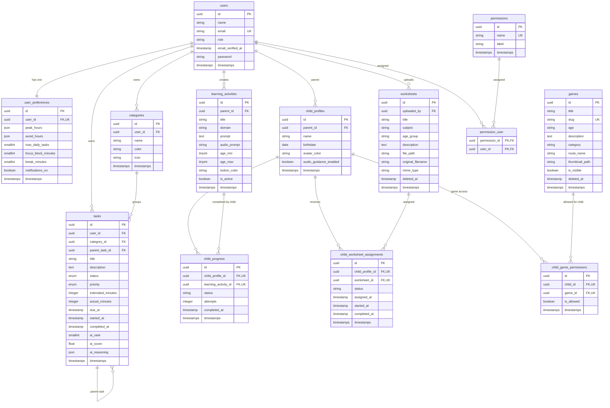

# Database ERD

This ERD shows the main application tables and how the Laravel models relate to each other.

## Relationship Summary

| Relationship | Laravel meaning |
| --- | --- |
| `User -> ChildProfile` | One parent user can have many child profiles. |
| `ChildProfile -> ChildProgress` | One child can have many progress records. |
| `LearningActivity -> ChildProgress` | One learning activity can appear in many child progress records. |
| `ChildProfile + LearningActivity -> ChildProgress` | The pair is unique, so one child has only one progress row per activity. |
| `User -> LearningActivity` | One parent user can create many learning activities. |
| `User -> Worksheet` | One user can upload many worksheets. |
| `ChildProfile + Worksheet -> ChildWorksheetAssignment` | The pair is unique, so one child receives one assignment row per worksheet. |
| `ChildProfile + Game -> ChildGamePermission` | The pair is unique, so one child has one permission row per game. |
| `User -> Task` | One user owns many tasks. |
| `Category -> Task` | One category can contain many tasks. A task category can be nullable. |
| `Task -> Task` | A task can have subtasks through `parent_task_id`. |
| `User -> UserPreference` | One user has one preference row because `user_id` is unique. |
| `User <-> Permission` | Many-to-many through `permission_user`. |

## Main Model Map

| Model | Table | Important relationships |
| --- | --- | --- |
| `User` | `users` | has many child profiles, tasks, learning activities, worksheets; belongs to many permissions |
| `ChildProfile` | `child_profiles` | belongs to parent user; has many progress rows, worksheet assignments, game permissions |
| `ChildProgress` | `child_progress` | belongs to child profile and learning activity |
| `LearningActivity` | `learning_activities` | belongs to parent user; has many child progress rows |
| `Worksheet` | `worksheets` | belongs to uploader user; has many child worksheet assignments |
| `ChildWorksheetAssignment` | `child_worksheet_assignments` | belongs to child profile and worksheet |
| `Game` | `games` | has many child game permissions |
| `ChildGamePermission` | `child_game_permissions` | belongs to child profile and game |
| `Task` | `tasks` | belongs to user, category, and optional parent task; has many subtasks |
| `Category` | `categories` | belongs to user; has many tasks |
| `Permission` | `permissions` | belongs to many users through `permission_user` |

## Laravel System Tables

These tables are also in the database but are not part of the main app domain ERD:

- `password_reset_tokens`
- `sessions`
- `cache`
- `cache_locks`
- `jobs`
- `job_batches`
- `failed_jobs`
- `personal_access_tokens`
